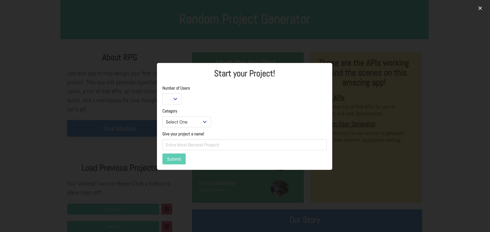
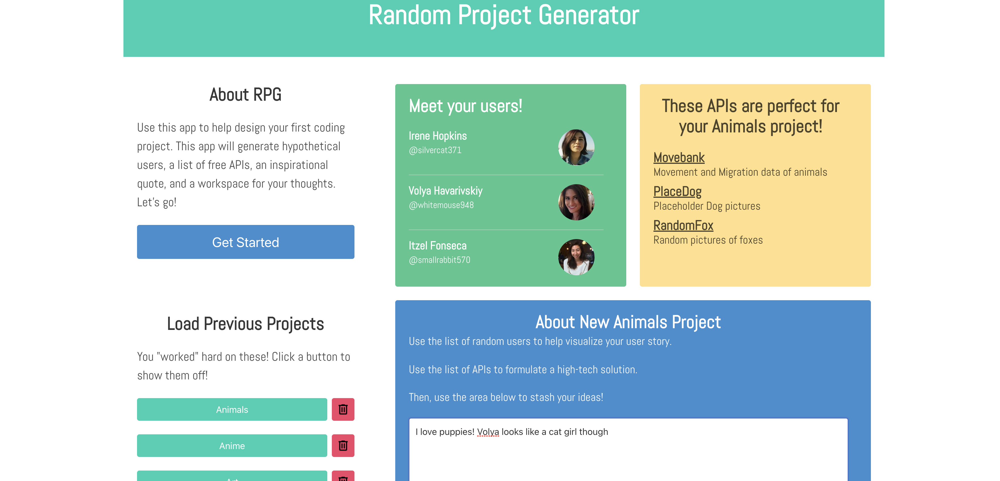

# Team-1-Project-1
Showcase or skills by developing an app that utilizes at least 2 APIs and one non-Bootstrap CSS library  

## Link
https://eclevela-1234.github.io/Team-1-Project-1/

## Basic Functionality
- App loads to a clean landing screen with information about the project, its contributors and api sources.

- Select the get started button to begin creating project ideas
- Modal will open and prompt the user for input pertaining to the app return. User must mark all fields to sumbit or they may cancel.

- Api call is made based on user reponses and the page is dynamically changed to new content provided by the api call. Also, a textarea element is diplayed so that the user can add additional notes to the project.

- Users can save project by selecting the save button, and access and edit old projects by selecting them from previous projects
- Users can also delete projects by selecting the red button next to the project

## Languages/Libraries
- HTML, CSS & JavaScript
- jQuery, jQuery UI, Bulma CSS, Google Fonts

## Future Considerations
- Additional api call for a random quote.
- Auto-save on modal submission and blur from textarea

## Challenges
- The Public API resource has very low threshold for api calls (about 10/hour) which made testing a challenge. We used diffrent tactics to deal with this like storing sample calls. Also once we had local storage testing became easier. Eventually found a workaround by running the call in an incognito window.
- We originally planned to use and AI text generator in our concept but encountered a pay wall so we had to scrap the idea. 
- From that setback, the textarea was born. The textarea actually added a cool interactive feature and improved the overall utility of the app.
- In general, working on separate parts of the app was challenging with the complexity of the task at hand. We strategized the connection between two major part (the modal & the api call) and described the expected variable out put from one to the other. Amazingly, connecting the two functions was easy because we stuck to the plan and did what we said we'd do.
- Bulma was a bit of a learning curve but offered some sleek elements and the easy responsiveness similar to Bootstrap. 